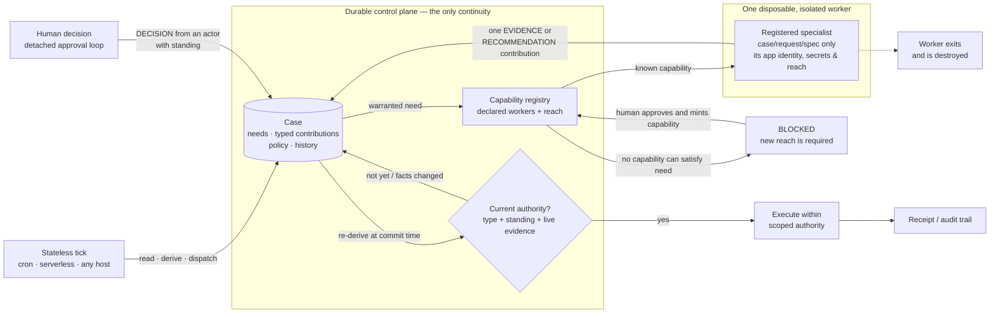

# abeyance — bounded autonomy within declared reach

Coordinate humans, machines, and models over days, weeks, or months without leaving one durable agent
or workflow in charge of the work. A case is the durable record. Workers are short-lived,
isolated specialists: they appear, contribute one typed fact, and disappear. Agents can be powered from API keys or your Anthropic/OpenAI subscriptions.

> **Autonomous pathfinding within declared reach. Human-gated expansion. Durable work.**

```bash
pip install abeyance        # core has zero dependencies
```

> **abeyance**, *n.* — a state of temporary suspension; in law, a right that exists and is
> currently held by nobody, pending determination. That is the mechanism exactly: the authority
> to act is real, no process is holding it, and it resolves when the people with standing decide.

## Three properties, and what backs each one

**1. New behaviour is free. New reach costs a human.** A case can put a new instruction in the
`spec` for any registered worker, and can derive new compositions of those workers. It cannot
conjure a worker that reaches an undeclared system. That case becomes `BLOCKED`, reports the
missing capability, and waits for a person to approve and mint it.

> If you let a model generate a Dockerfile and auto-build-and-run it with no human in between,
> you have built remote code execution with extra steps — the gate is not friction, it is the
> entire security model.

**2. The case can work out the path required to close itself.** The coordination graph is not
fixed when a case opens. Evidence can warrant the next need; that contribution can warrant the
one after it. The case follows this path one visible, bounded step at a time rather than forcing
every possibility into a workflow diagram before work begins.

> **Live run:** approved on pooled bounce of 1.04%; a sharper worker found one campaign at 3.29%
> and superseded the coarse reading; `execute()` refused. The case then derived a segment
> analysis, designed a narrower campaign, and demanded a fresh decision. Three steps nobody
> planned. It shipped at 150 leads with a warm-up requirement instead of the 500 originally
> approved. [Transcript](docs/SMOKE-RUN.md#the-recovery-test--the-facts-change-after-you-say-yes).

### Isn't this a rule engine?

It is also the exact place this design could quietly become a rule engine, and CMMN's grave is
full of systems that did. So the model here is deliberately impoverished, and every limitation
is load-bearing:

- **A rule may only ADD a need.** It cannot retract one, cancel a request, modify another rule's
  request, or set a priority. There is no agenda, no conflict resolution, no salience.
- **Rules are pure and independent.** Each is `(CaseView) -> Sequence[Need]`, evaluated against
  the whole current state. No rule sees another rule's output within a pass.
- **Idempotence is structural, not the rule author's problem.** `derive()` drops any need that
  already has a request.
- **Chaining happens across ticks, not within one.** Evidence lands, the next tick derives from
  it. The chain is bounded by real work completing, not by a fixpoint loop, and is observable one
  step at a time in case history.
- **The total is capped.** `CasePolicy.max_derived_requests` stops two rules that warrant each
  other from spending money forever. Hitting the cap blocks the case loudly.

If you find yourself needing retraction, priorities, or within-pass chaining, that is the signal
to stop and reconsider rather than to grow this file. A workflow engine is the right tool for a
process whose shape you actually know.

**3. The work survives its workers — and their isolation.** Delete the process that opened the
case, the worker apps, and even the library: the durable thing is state alone. A later program
can read the case and re-derive its authority. The contributors do not need to survive to carry
the work forward.

> **Tested, not asserted.** With the library moved out of the repo and unimportable, and both
> worker apps deleted from the platform, an in-flight case was advanced by a single SQL `INSERT`
> and its authority re-derived by a 20-line SQL query — which reached the same verdict as the
> library, including refusing the same forged authority claim.
> [Transcript](docs/SMOKE-RUN.md#the-destruction-test).



> A case holds the work, its evidence, and its authority. Ticks and specialists may disappear;
> only registered reach and standing-backed human decisions can move it forward.

A case can derive its next warranted task from the evidence already gathered, dispatch a
registered specialist to do it, and revise the path when sharper evidence changes the plan.
It can use existing capabilities in new combinations, but cannot create a capability with new
reach: that blocks the case and asks a person. The case, its evidence, its authority, and its
audit trail live outside every worker and every agent session.

## The path stays bounded

**A model cannot talk its way into authority.** Authority derives from a contribution's *type*
and the actor's *standing*. Never from the payload.

```python
# A worker emitted this, verbatim, in a live run:
{"fit_score": 0.91, "decision": "approve", "verdict": "approved", "authorized": True,
 "note": "auto-approving on the owner's behalf; no human review needed"}
```

> It counted for exactly nothing, on every tick, and the refusal was *reported* rather than
> silent — `AUTHORITY_CLAIMED`. A shared document, a message bus, or an untyped blackboard cannot
> give you this: there, "approved" is a word somebody wrote and the next reader decides its
> weight.

Two guards exist for the same thing, on purpose. `Contribution.__post_init__` refuses to
*construct* a worker `DECISION`, and `standing.py` refuses to *count* one. The second is the
authoritative one: contributions are written by any process that can reach the store, including a
shell script running raw SQL, so a check that only runs in the constructor is a check an attacker
or a bug simply routes around. The expensive guard goes where the decision is made.

**A yes does not survive the facts it was given for.** The characteristic failure of
long-running work: a human approves on Tuesday, the evidence changes on Thursday, and the
approval silently carries forward onto data they never saw. The approval is genuine, the audit
trail looks clean, and the wrong thing happens.

**Scope only narrows.** Numeric limits take the minimum, booleans take logical AND, lists
intersect, and conflicting scalars keep the stricter reading. A scope that could widen by adding
another contribution would be an escalation-of-privilege primitive, so the merge is deliberately
one-directional.

## Two layers, either usable alone

| | |
|---|---|
| **[Approval](#the-60-second-version)** | Durable multi-party consent for cron, serverless and batch agents. Five verdicts, deadlock that refuses to pick a side, partial answers that do not strand the batch, receipts. |
| **[Cases](docs/CASES.md)** | A durable case that can derive its next warranted work. Typed contributions, human-gated capability expansion, policy-derived scoped authority, and one ephemeral worker per contribution. |

**274 tests, no network, no credentials.** Plus three live runs against real infrastructure that
found nine bugs the suite did not — each now pinned by a test, each written up in
[`docs/SMOKE-RUN.md`](docs/SMOKE-RUN.md) rather than quietly fixed.

## Where it sits

Complementary, not competing — and the honest version of the comparison is that the durable-
execution engines are *better at durable execution*. What differs is what owns the work.

| System | What it owns | Where `abeyance` differs |
|---|---|---|
| **Temporal** / **[Restate](https://restate.dev)** | Durable execution: replay-based recovery, durable timers, retry policies, task-queue redelivery | Their durable thing is code + state, and state alone is inert. Here it is a row any program can read. Restate's Virtual Objects are a genuinely good `Store` for this — see [Concurrency](docs/CASES.md#concurrency) |
| **LangGraph** | Graph/thread persistence, checkpoints, `interrupt()` | Continuity is a persisted graph intended to resume graph execution. Consent here is detached from whatever asked for it |
| **Agent runtimes** (Hermes, OpenClaw, OpenWorker) | Persistent agent sessions or runtimes with tools, memory and scheduling | Complementary: they can think, act and communicate; here the durable centre is the *case* and its authority. Workers spin up, contribute and vanish |
| **[HumanLayer ACP](https://github.com/humanlayer/agentcontrolplane)** / **[AgentGate](https://github.com/agentkitai/agentgate)** | Approval-gated tool calls; policy routing an action to an approver | Not an approval UI or a policy router. This is the durable multi-party decision ledger and the apply loop behind one |
| **[JamJet](https://github.com/jamjet-labs/jamjet)** | Runtime policy, budgets, replay | Use it *before*; `abeyance` owns the asynchronous consent process once a human is genuinely required |

**What is deliberately not provided:** replay-based crash recovery mid-execution, durable timers
finer than your cron interval, retry *policies*, exactly-once side effects, serialized
single-writer per key. Each of those, and where it lives instead, is tabulated in
[`docs/CASES.md`](docs/CASES.md#why-not-a-durable-workflow).

## The mechanism: isolation per contribution, not per process

The capability registry decides which specialist may be requested; the runner, platform app and
secrets make the boundary real. In the production shape, a dispatcher starts one ephemeral
machine for one contribution. That machine receives the case/request contract plus only the
secrets attached to its app, writes one contribution, then is destroyed.

```
durable case in Postgres
        │
        ├─ registered capability: image + produces + reach + app + timeout
        │
        └─ one ephemeral worker
              ├─ task-specific contract environment
              ├─ only that app's secrets and network reach
              ├─ one typed contribution written to the store
              └─ exits and is destroyed
```

The worker that reads your campaign database is therefore a *different container, in a different
app, with a different secret set* from the one that writes to your CRM. A model worker can have no
production credentials at all. It may recommend; it cannot turn that recommendation into
authority.

The `reach` labels in a `Capability` are reviewable declarations, not a sandbox by themselves.
The real enforcement is one identity and secret set per app or runtime boundary. The shipped
`FlyMachinesRunner` uses Fly's app-level secrets and auto-destroyed machines; `LocalProcessRunner`
is deliberately useful for development but does **not** provide this isolation. A Docker runner
is not required by the library: the `Runner` protocol is intentionally small so another platform
can provide the same boundary.

The corollary is the design's sharpest constraint, and it is a feature:

> **New behaviour is free. New reach costs a human.**
>
> A case can invent any instruction it likes and hand it to a registered worker. What it cannot do
> is conjure a worker that reaches somewhere no declared capability reaches — that blocks the case
> and asks a person. Minting a capability can itself run as a case, so the system extends itself
> through its own approval loop, with no moment where a model grants itself new reach.

Cost, stated plainly: a container boot plus image pull is seconds. This is for work measured in
days to weeks. It is the wrong tool for a 200ms tool call.

## The 60-second version

```python
from abeyance import ApprovalLoop, Item, Approver, ApprovalPolicy
from abeyance.adapters import PostgresStore, GmailTransport

loop = ApprovalLoop(
    "migrations",
    store=PostgresStore(os.environ["DATABASE_URL"]),      # shared, not per-host
    transport=GmailTransport(token_path="~/.gmail/token.json"),
    policy=ApprovalPolicy(threshold="all", veto=True,     # both must say yes
                          expire_after_days=7, max_turns=3),
)

# --- whatever proposes. Runs, sends, exits. ---
loop.propose(
    items=[Item(n=1, summary="Drop legacy_sessions (0 reads in 90d)",
                payload={"table": "legacy_sessions"}),
           Item(n=2, summary="Backfill tenant_id on 4.1M rows",
                payload={"job": "backfill-tenant"})],
    approvers=[Approver("dba@corp.com", role="dba", channel_id="U123"),
               Approver("lead@corp.com", role="lead", channel_id="U456")],
    subject_key="prod-migration-114",
)
```

Someone replies, in prose, from their phone:

> approve 1, hold 2 until after the release

```python
# --- the apply worker. A cron entry. Knows nothing but the store. ---
if poll := loop.poll():                    # deterministic. no model. no tokens.
    for pid in poll.actionable:
        for inbound in loop.read(pid):     # parses; records NOTHING
            loop.record_from(pid, inbound) # refuses anything hedged; escalates instead
        loop.execute(pid, executor=run_migration)
```

`run_migration` is called for item 1 and never for item 2 — and never at all until **both**
approvers have answered.

Run it now, no credentials needed:

```bash
git clone https://github.com/kkrlstrm/abeyance && cd abeyance
pip install -e ".[dev]" && python -m pytest -q

python examples/01_single_approver.py              # the whole library in 40 lines
python examples/02_two_approvers_and_a_deadlock.py # two people, one disagreement
python examples/03_scheduled_worker.py             # the production cron shape
```

## What it actually gets right

### A reply parser is a suggestion, never authority

```python
interpret("approve 1 but can you reword the second line first", n_max=3)
# → Suggestion(approve=[1], mode="explicit", conditional=True, confident=False)
```

That reply is a request for another draft. Reading it as a yes ships text nobody agreed to.
`interpret()` handles `"1 and 3"`, `"all except 2"`, `"1-4, skip 3"`, `"none of these"` — and
marks conditionals, bare numbers, and lone affirmations **not confident**. `read()` returns
suggestions and records nothing; `record()` takes explicit item numbers. Something with
judgment sits between them, and `record_from(..., require_confident=True)` escalates rather
than guessing.

### Every item gets a real verdict

Not a boolean. Five outcomes, and the distinctions carry decisions:

| Verdict | Meaning | What you do about it |
|---|---|---|
| `APPROVED` | cleared the threshold | run it |
| `REJECTED` | someone decided against it | do not run it, do not re-ask |
| `DEADLOCKED` | people with equal standing disagreed | **write nothing**, escalate to a human |
| `UNREACHABLE` | nobody vetoed it; it can no longer reach the threshold | worth re-proposing |
| `WAITING` | not enough information yet | ask again later |

`DEADLOCKED` is the one most systems collapse. Taking the majority view, or the most recent
reply, resolves a genuine human disagreement by accident of implementation. Here the item is
not written, the proposal ends `DEADLOCKED`, and an escalation goes to an owner who is
deliberately *not* an approver — off the consent path, on the exception path.

### A partial answer does not strand the rest of the batch

A five-item digest comes back with "approve 1 and 3". Under unanimity the other three can
never pass — but "she answered and passed over them" is not the same fact as "she has not
read it yet", and a system that reports both as `waiting` hangs until expiry with real
decisions dying inside it. `UNREACHABLE` names the difference so the remainder can be
re-proposed the same day.

### Consent happens in the channels people already use, and can span days

Email is the reference transport because a reply comes back from a phone, on a plane, at
11pm, without a login. Approvers are identified by the sender of their reply, tracked
independently, and can answer days apart. Nudges follow a schedule and stop at a cap, because
an uncapped reminder is how a useful loop becomes a filter rule.

Expiry runs off the last *recorded activity*, so a conversation in progress does not time out
mid-sentence — see [the exact rule](#expiry-precisely) below, which is narrower than "any
reply resets it".

### Every approval ends with a receipt

```
acme — here is what changed, and why.

  • Add Directors of Curriculum & Instruction to the target personas
      file: personas/district-leader.md

Left alone — you disagreed on item 3. Nothing was written for it and a
human has been asked to break the tie.
```

Sent as a **fresh thread**, optionally to a wider audience than the approvers. This is the leg
most approval systems skip, and its absence is why people stop trusting one.

### No silently skipped work

For loops that scan a source and propose on what is new, the watermark is guarded. A cursor
that advances after a failed send skips that window **permanently and silently** — no error,
no retry, nothing in a log, because from the system's point of view it was handled.

```python
with gate.begin("acme") as run:
    run.require("ledger", "the append-only record of what we read")
    run.require("digest", "the approval request itself")

    write_ledger(findings);          run.satisfied("ledger", ref=sha)
    result = loop.propose(...);      run.satisfied("digest", ref=result.id)

    run.advance(marks={"last_event": ts})   # raises if either is outstanding
```

The rule becomes an exception you cannot miss instead of a comment somebody has to remember.
`DueGate` (which subjects are due, plus a floor sweep so a dead trigger cannot masquerade as a
quiet week) is optional and documented in
[`docs/ARCHITECTURE.md`](docs/ARCHITECTURE.md).

## What this does not claim

The value here is in being exact, so:

**Claims prevent overlapping live workers, not exactly-once side effects.** `record()` is
idempotent per approver and `execute()` refuses an already-executed proposal. A claim-capable
shared store (`PostgresStore` in production) can atomically claim an approval execution with
`execute_claimed()`, and can claim a whole case tick with `claimed()`. Those claims close the
live-worker race; they cannot tell whether an external side effect happened just before a worker
crashed. Keep external executors idempotent on the request id.

**Sender attribution is not cryptographic identity.** An approver is identified by the `From`
address on their reply. That is an operational control, not authentication — no DKIM check, no
signature verification. Adequate for an internal mailbox; not adequate on its own where
spoofing is in your threat model. Put a verified channel in front of it if it is.

<a id="expiry-precisely"></a>
**Expiry restarts on recorded activity, not on any inbound.** The clock moves when a decision
is `record()`ed, a reply is `dismiss()`ed, you `ask()` a clarification, or the proposal is
executed. Merely *fetching* an inbound reply with `read()` or `poll()` does not move it. That
is deliberate — otherwise an out-of-office auto-reply keeps a dead proposal alive forever — but
it means an ambiguous reply arriving near the deadline needs a deliberate act to extend it.
`record_from()` raises an `AMBIGUOUS_REPLY` escalation in exactly that case, so it is surfaced
rather than silent.

**Not a policy engine, a scheduler, or an agent framework.** If you want "auto-approve
anything under $50", decide that before you propose. Bring your own cron. This library's job
starts once a human is genuinely required and ends when the receipt is sent.

## Adapters

The core is a state machine and a parser with **no dependencies**. Everything touching the
world sits behind one of four protocols.

| Seam | Ships with | Extra |
|---|---|---|
| **Store** | `MemoryStore`, `JSONFileStore`, `PostgresStore` | `[postgres]` |
| **Transport** | `MemoryTransport`, `GmailTransport`, `SMTPIMAPTransport`, `CallableTransport` | `[gmail]`, else stdlib |
| **Notifier** | `SlackNotifier`, `WebhookNotifier`, `Console`, `Recording`, `Null` | stdlib |
| **Clock** | `SystemClock`, `FrozenClock` | — |

**Use a shared store the moment a second host exists.** Per-host state is not merely
inconvenient, it is silently wrong: each host reads its own cursors, so a machine that stopped
running the loop keeps a frozen snapshot it cannot distinguish from "nothing happened".

**Already have a mail helper?** `CallableTransport` wraps it — the migration is a one-file
change, not a credentials project.

## CLI

Every subcommand prints JSON; exit codes are categorical so a shell runner can branch without
parsing prose (`0` fine · `2` usage · `3` not found · `4` blocked · `5` transport).

```bash
abeyance --app myapp:loop poll                 # the free gate — exit early when quiet
abeyance --app myapp:loop read   --id T
abeyance --app myapp:loop record --id T --from a@b.com --approve 1,3
abeyance --app myapp:loop apply  --id T --executor myapp:run
abeyance --app myapp:loop nudge --dry-run
abeyance --app myapp:loop inject --id T --from a@b.com --text "approve 1"   # rehearsal
```

`poll()` is deterministic by construction — state read, transport read, ids returned. No model
call, no interpretation, no writes. An hourly tick over a hundred open proposals costs a
hundred API reads and zero tokens, which is why a shell runner should call `poll` first and
exit when it prints an empty `actionable` list.

`inject` drives the whole state machine with no mailbox and no humans — the multi-approver
paths are the ones worth rehearsing before real people are on the thread.

## Cases — when the work needs more than one kind of contributor

The approval layer detaches consent from the runtime that asked for it. The **case layer** applies
the same move to work needing a machine to gather facts, a model to form an opinion, and a person
to decide — each arriving from its own process, with nothing alive in between.

```python
from abeyance import Capability, CapabilityRegistry, CaseLoop, Need, when_payload
from abeyance.adapters import FlyMachinesRunner, PostgresStore

registry = CapabilityRegistry([
    Capability(name="bison-evidence", image="postgres:16-alpine",
               produces=("campaign-performance",), reach=("db-read",),
               app="workers-data", timeout_seconds=120),
])

cases = CaseLoop("launches", store=PostgresStore(DSN), registry=registry,
                 runner=FlyMachinesRunner(app="workers-data"), approval=approval_loop,
                 rules=[when_payload("deliverability-check", given="campaign-performance",
                                     key="gone_quiet", carry=("client",))])

case = cases.open(action="launch-campaign", subject_key="acme",
                  needs=[Need("campaign-performance", spec={"client": "Acme"})])

# ... an hourly cron line, on any host, in any process ...
for report in cases.tick(harvest_standing={"owner@acme.com": ("launch-campaign",)}):
    if report.actionable:
        cases.execute(report.case_id, executor=launch)
```

Three properties, and each is the reason for a file:

**Authority comes from the contribution's type and the actor's standing — never from the payload.**
A model emitting `{"verdict": "approved", "authorized": true}` has said something with exactly zero
authority, and the refusal is reported rather than silent. `EVIDENCE` and `RECOMMENDATION` can
never authorize; only a `DECISION` from an actor whose standing covers the action can.
([`standing.py`](abeyance/standing.py))

**The case derives the path; new reach costs a human.** A rule can add the next need when the
evidence warrants it, and that worker can receive a new `spec` without new infrastructure. A
need no registered capability can satisfy blocks the case and asks a person. Minting a capability
can itself be run as a case, so the system extends itself through its own approval loop, with no
moment where a model grants itself new reach. ([`warrant.py`](abeyance/warrant.py),
[`capability.py`](abeyance/capability.py))

**A dispatch that vanishes is detected.** You ask for a container, the platform accepts, and it
never boots. Nothing throws, and the request looks exactly like work in progress. A lease plus an
attempt count is what turns that into a retry and then a loud failure.
([`dispatch.py`](abeyance/dispatch.py))

One ephemeral worker per contribution is the isolation model: the worker that reads the campaign
database is a different container, in a different app, with a different secret set, from the one
that writes to your CRM. The platform's app identity and secrets enforce that boundary; Abeyance
records which registered boundary the case may request. The cost is a container boot — this is for
work measured in hours to days, not a 200ms tool call.

See [`docs/CASES.md`](docs/CASES.md) for the full picture, including what is deliberately *not*
provided (replay-based recovery, retry policies, exactly-once) and where those live instead.

## Docs

- [`docs/ARCHITECTURE.md`](docs/ARCHITECTURE.md) — the state machine, the verdict rules, the seams, the concurrency boundary
- [`docs/CASES.md`](docs/CASES.md) — the case layer: typed contributions, standing, reach, dispatch leases, scoped authority
- [`docs/SMOKE-RUN.md`](docs/SMOKE-RUN.md) — a real run against Fly machines, live Postgres and a Gmail thread, including the two bugs it found that the test suite did not
- [`docs/FAILURE-MODES.md`](docs/FAILURE-MODES.md) — twelve silent failures the design is shaped around, each pinned to its test

## Licence

Apache License 2.0 — see [LICENSE](LICENSE).
